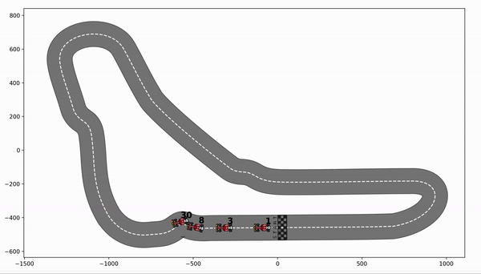
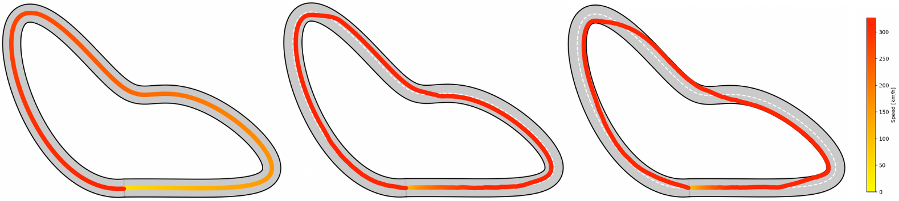
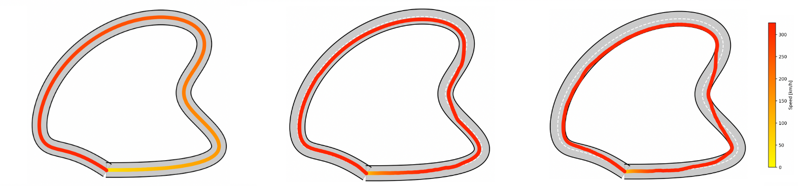
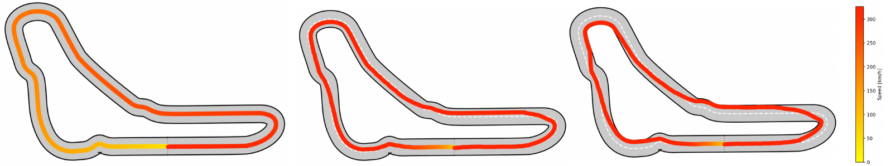

# Autonomous Car Racing control via LMPC
Learning Model Predictive Control for Autonomous Car Racing (ARC) based on method explained in

# Installation
1. Clone the repository:  
 ```sh 
 git clone "https://github.com/cybernetic-m/arc_lmpc.git"
 cd arc_lmpc

2. Install the dependencies:  
```sh 
pip install -r requirements.txt

# Structure 
The code is structured in this way:
1.

# Usage
1. 

# Race


# Best Lap


# Water Fall Track


# Tornado Circuit


# Monza Circuit


# References
[1]. [U. Rosolia and F. Borrelli: Learning Model Predictive Control for Iterative
Tasks. A Data-Driven Control Framework](https://ieeexplore.ieee.org/stamp/stamp.jsp?tp=&arnumber=8039204).

[2]. [H. Xue et al. : Learning Model Predictive Control with Error Dynamics Regression for Autonomous Racing](https://arxiv.org/pdf/2309.10716).

[3].  [U. Rosolia and F. Borrelli : Learning How to Autonomously Race a Car: A Predictive Control Approach](https://ieeexplore.ieee.org/stamp/stamp.jsp?tp=&arnumber=8896988).



