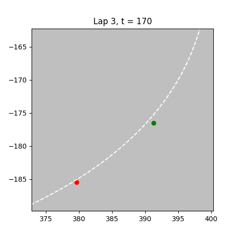

# Autonomous Car Racing control via LMPC
Learning Model Predictive Control for Autonomous Car Racing (ARC). 

1. **Planning and Modelling**: In the planning phase we have used two different techniques (**Polynomial Interpolation** and **Beziér Curves**) to plan the trajectory. We have created three different tracks: **Waterfall Track**, **Tornado Circuit** and **Monza Circuit**. In the modelling phase we have model the ARC using the **kinematic model of the bicycle**.

2. **Control**: we have used two different techniques of **LMPC** control described in [1] (**Q Table**) and [3] (**Convex Hull**).

# Installation
1. Clone the repository:  
 ```sh 
 git clone "https://github.com/cybernetic-m/arc_lmpc.git"
 cd arc_lmpc
 ```

2. Install the dependencies:  
```sh 
pip install -r requirements.txt
```

# Project Structure 

```sh 
arc_lmpc
├── LICENSE
├── README.md
├── controller 
│   ├── lmpc_control.py => LMPC controller with convex hull (Reference [3])
│   ├── qlmpc_control.py => LMPC controller with Q Table (Reference [1])
│   └── trivial_control.py => Path following controller at constant velocity 
├── gif_images
│   ├── gif_race.gif
│   ├── lap_gif.gif
│   ├── track1traj.png
│   ├── track2traj.png
│   └── track3traj.png
├── main.py => Main to execute the LMPC with convex hull
├── main_q.py => Main to execute the LMPC with Q Table
├── requirements.txt
└── utils
    ├── animation.py => File to generate the best lap animation and the race animations
    ├── images
    │   ├── car.png
    │   └── start_flag.png
    ├── model.py => File that contain the kinematic model of the robot and all important quantities
    ├── track.py => File that contain the track with polynomial interpolation and its definitions
    └── track_bez.py =>File that contain the track with Bezier Curves and its definitions 
 ```

# Usage
To use the project you can run:
1. LMPC Control with Convex Hull
```sh 
python3 main.py
```
2. LMPC Control with Q Table
```sh 
python3 main_q.py
```

# Race
In the race it's possible to see that the LMPC with convex hull at lap=30 perform better with respect to the previous iterations. 


# Monza Best Lap
In this video we're plotting the lap=41 with crc=1 and delta_weight=1.
In the right plots it's possible to see the evolution of velocity, acceleration, steering angle and distance from the center of the track (n).
 


# Algorithm explanation
The LMPC Convex Hull based algorithm works in this way:
1. The set of K nearest neighbors is extracted from the j-l = 2 previous iterations. In this case, K=10 (number of neighbors).
 2. From the convex hull of the neighbors the yellow dot is extracted that is feasible to be the last point of the horizon and whose cost is lower; at the same time, also the trajectory is computed (blue line)
3. The first optimum control generated is applied to the car and the algorithm starts again.

**Legends**:
1. **Red Dot**: Actual CoM of the car
2. **Green Dot**: Initial Guess of end point
3. **Black Squares and Triangles**: K-Nearest Neighboors from previous 2 laps
4. **Yellow Dot**: End Point computed through convex hull
5. **Blue Line**: Computed trajectory



# Waterfall Track
In this plots it's possible to see the evolution of the trajectories in the Waterfall Track (Lap 1, 10, 22).


# Tornado Circuit
In this plots it's possible to see the evolution of the trajectories in the Tornado Circuit (Lap 1, 10, 25).


# Monza Circuit
In this plots it's possible to see the evolution of the trajectories in the real Monza Circuit (Lap 1, 10, 25).


# References
[1]. [U. Rosolia and F. Borrelli: Learning Model Predictive Control for Iterative
Tasks. A Data-Driven Control Framework](https://ieeexplore.ieee.org/stamp/stamp.jsp?tp=&arnumber=8039204).

[2]. [H. Xue et al. : Learning Model Predictive Control with Error Dynamics Regression for Autonomous Racing](https://arxiv.org/pdf/2309.10716).

[3].  [U. Rosolia and F. Borrelli : Learning How to Autonomously Race a Car: A Predictive Control Approach](https://ieeexplore.ieee.org/stamp/stamp.jsp?tp=&arnumber=8896988).



